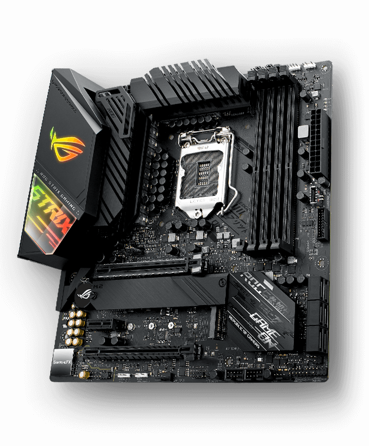

#  ASUS-ROG-STRIX-Z490G OpenCore EFI

  

## Software

|     Name      | Version |
| :-----------: | :-----: |
|     macOS     |  14.7   |
|   OpenCore    |  1.0.1  |
|   AppleALC    |  1.9.1  |
|     Lilu      |  1.6.8  |
|    NVMeFix    |  1.1.1  |
|  VirtualSMC   |  1.3.3  |
| WhateverGreen |  1.6.7  |
| AirportItlwm  |  2.3.0  |

## Hardware

|   Part    |               Model                |      Comments      |
| :-------: | :--------------------------------: | :----------------: |
|    CPU    |        Intel Core i7-10700         |       Stock        |
|   MOBO    |           ASUS ROG Z490G           |   Wi-Fi Version    |
|    RAM    | CORSAIR - Vengeance RGB PRO 8GB\*4 | OC to 3200 MHz C16 |
|   iGPU    |       Intel UHD Graphics 630       |      Enabled       |
|   dGPU    |          NVIDIA RTX 3800           |      Disabled      |
| Storage 1 |     Seagate FireCuda 510 1 TB      |     Windows HD     |
| Storage 2 |    Seagate FireCuda 120 500 GB     |   Hackintosh HD    |

## Features

|               Function                | Status |             Comments             |
| :-----------------------------------: | :----: | :------------------------------: |
|                  USB                  |   ✅   |     See USB mapping section      |
|               Ethernet                |   ✅   |   Using Apple's I225LM driver    |
|                 Wi-Fi                 |   ✅   |    Using AirportItlwm driver     |
|               Bluetooth               |   ❌   | Need to add IntelBT card driver  |
| AirDrop, Handoff, Universal Clipboard |   ✅   |    Using AirportItlwm driver     |
|         Hardware Acceleration         |   ✅   | Using iGPU Hardware Acceleration |
|                  DRM                  |   ✅   | Using iGPU Hardware Acceleration |
|                 Sleep                 |   ✅   |   Need to use mouse to wake up   |

## Modify config.plist in the OC Folder

This repository contains EFI based on OpenCore 0.9.5. If you're using the same mobo, then this EFI is likely working for you. But if you have different parts other than mobo, please read the following content and modify it accordingly.

- [OpenCore]("https://dortania.github.io/OpenCore-Install-Guide/")

> [!NOTE]
> You need [ProperTree](https://github.com/corpnewt/ProperTree) to open and edit config.plist.
